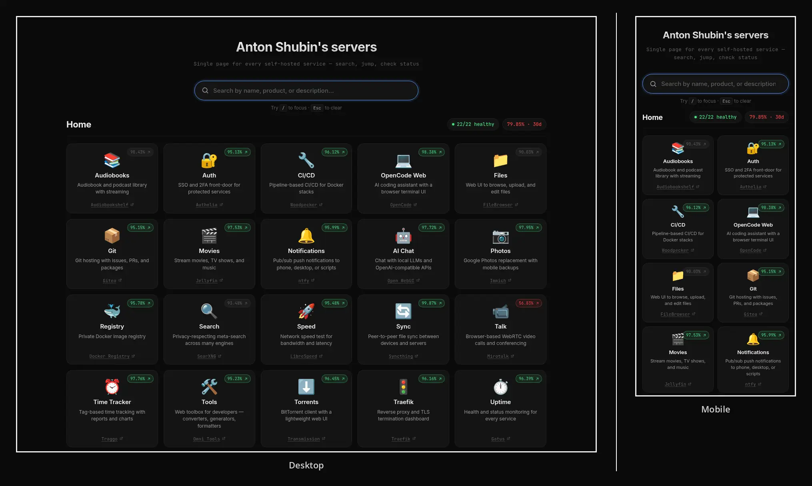

<div align="center">

# oko 👁

**One page for every self-hosted service, with its status and 30-day uptime from gatus.**

[](https://ci.antonshubin.com/repos/7)
[](https://github.com/users/spy4x/packages/container/package/oko)
[](LICENSE)

[**Live dashboard →**](https://dash.antonshubin.com/) ·
[Self-hosting](docs/self-hosting.md) · [Configuration](docs/configuration.md) ·
[How it works](docs/how-it-works.md)



</div>

You list your services in one JSON file. oko renders them as one searchable
page, and for each service that [gatus](https://github.com/TwiN/gatus) watches,
it shows whether it is up and its uptime over the last 30 days. **oko** (око,
Russian for "eye") is the page you open to find a service and see at a glance
that everything is fine.

I built it for my own servers and run it at
[dash.antonshubin.com](https://dash.antonshubin.com/).

## Why oko

- **One page, every service.** Grouped by server, searchable, with `/` to focus
  the search and `Esc` to clear it.
- **Status you can trust.** Up, down and 30-day uptime come from gatus. When
  gatus does not answer, the service shows "unknown", never a false green or
  red.
- **Edit a file, not a UI.** Change `config.json` and the next page load shows
  it. No restart, no database, no accounts.
- **Plain HTML.** The server renders the whole page; the only JavaScript is the
  search filter. No client framework, no build step.
- **Fast under load.** Badge fetches run in parallel and are cached in memory
  for 60 seconds by default, so a burst of visitors costs gatus one round of
  requests.
- **Tiny to run.** A static Go binary with no dependencies beyond the standard
  library, in an 11 MB distroless image that runs as non-root.

**Use it if** you run gatus and want one friendly page for your self-hosted
services. **Skip it if** you need a public status page, metrics graphs, or a
tool that probes services itself: see
[what oko is not](docs/how-it-works.md#what-oko-is-not).

## Quick start

```yaml
# compose.yml
services:
  oko:
    image: ghcr.io/spy4x/oko:latest
    restart: unless-stopped
    ports: ["8080:8080"]
    environment:
      DOMAIN: example.com                # replaces ${DOMAIN} in service URLs
      UPTIME_HOSTS: uptime.example.com   # your gatus host(s), comma-separated
    volumes: ["./config.json:/app/config.json:ro,z"]
```

```json
{
  "title": "Jane Doe's servers",
  "servers": [
    {
      "name": "Home",
      "services": [
        {
          "name": "Photos",
          "url": "https://photos.${DOMAIN}",
          "icon": "📷",
          "endpoint": "home_photos",
          "gatus_host": "uptime"
        }
      ]
    }
  ]
}
```

Save the second block as `config.json`, run `docker compose up -d` and open
`http://localhost:8080`. `endpoint` is the gatus endpoint's key, and
`gatus_host` is the first label of a host in `UPTIME_HOSTS`.

## Configuration

Required: `DOMAIN`, `UPTIME_HOSTS`, and in `config.json` each server's `name`
and each service's `name` and `url`. Ports, timeouts, cache length, file paths
and the optional card fields are in [configuration.md](docs/configuration.md).
Reverse proxy, health check and `docker run`:
[self-hosting.md](docs/self-hosting.md).

## Development

```bash
go test ./...
DOMAIN=example.com UPTIME_HOSTS=uptime.example.com CONFIG_PATH=config.example.json \
  TEMPLATE_PATH=web/template.html go run ./cmd/oko
```

More in [CONTRIBUTING.md](CONTRIBUTING.md).

## Built by

I'm [Anton Shubin](https://antonshubin.com), a senior full-stack engineer and
tech lead. oko is one of the small tools I build and run on my own servers. Need
something like it built for your product?
[That's my day job →](https://antonshubin.com)

Licensed under [MIT](LICENSE).

---

Made by Anton Shubin · [antonshubin.com/tools](https://antonshubin.com/tools)
